<div align="center">


# QUANTUM GAMMAWAVE

**Twelve voices. Six tracks. Nine synthesis engines. One M-VAVE FM-1.**

<table>
  <tr>
    <td colspan="4" align="center"><a href="https://guillel51.github.io/Quantum-GammaWave/"></a></td>
  </tr>
  <tr>
    <td colspan="1" align="center"><a href="https://guillel51.github.io/Quantum-GammaWave/emulator/"></a></td>
    <td colspan="2" align="center"><a href="https://guillel51.github.io/Quantum-GammaWave/webapp/editor/"></a></td>
    <td colspan="1" align="center"><a href="https://guillel51.github.io/Quantum-GammaWave/webapp/installer/"></a></td>
  </tr>
  <tr>
    <td colspan="1" align="center"><a href="LICENSE"></a></td>
    <td colspan="2" align="center"><a href="https://www.gnu.org/licenses/gpl-3.0-standalone.html"></a></td>
    <td colspan="1" align="center"><a href="https://github.com/Guillel51/Quantum-GammaWave"></a></td>
  </tr>
</table>


<a href="https://guillel51.github.io/Quantum-GammaWave/emulator/"></a>
<a href="https://guillel51.github.io/Quantum-GammaWave/webapp/editor/"></a>
<a href="https://guillel51.github.io/Quantum-GammaWave/webapp/installer/"></a>

`v3.0.1` · identity `FM-1_965` · GPL-3.0-only · AC791N (JieLi WL82) · 240 × 240

- **The target render loops fit their budgets.** `phase_render` 84/84, `wheel_block` 32/86, `noise_render` 218/201 and `fm6_render` 292/322 in the pi32v2 disassembly, with the historical budgets untouched and all 291 golden renders unchanged.
- **One version everywhere.** `FELUCCA_VERSION`, the package in `release/`, the emulator the portal serves and `firmware/versions.json` name the same build: the portal shows the version and the commit the release manifest carries, and the installer checks the package's SHA-256 and size before it writes.
- **The package is integrity-checked, not signed.** Since v2.6.0 the model is SHA-256 + size + build record; Ed25519 (`qg1-release-1`) stays historical. The installer and the site say "integrity, not authenticity" instead of implying a signature that does not exist.
- **ROOM is damped by the table the firmware uses.** `rev_room` and `rev_room_mod` read `rev_damp_table[]`, and the host reference model now carries its own copy of that curve, so a change on one side still fails the test (it used to compare against the pre-2.4.0 linear law).
- **The constant tables are measured, not estimated.** `tools/table_sizes.py` reads each table out of the linked AC791N ELF: **41 947 B** in total (S 14 669 · M 8 420 · L 5 049 · icons 7 885 · keycaps 5 414 · shapes 158 · palettes 352), after the M face went to two horizontal phases (gap error **0.044 px**, `text_spacing_test`) and eleven icon cells no screen could reach were removed. HOME's five retired views took another **5 176 B** with them, so the image is **574 992 B** of a 583 612 B slot — **8 620 B** of room — and the package 610 959 B.
- **Five HOME screens** — MAIN, VISUALIZER, OVERVIEW, MIX, PERFORM — **twelve voices, six tracks, nine engines, 273 sounds.** HOME used to carry ten pages; the engine, matrix, envelope, system and routing ones were the same controls their own sections already have (EDIT, MOD, EDIT > ENV, SYSTEM, FX > BUSES), so they moved out instead of being drawn twice, and the walk is now five taps end to end. The bank is audited as data (`tools/preset_audit.py`: 0 problems) and measured as sound (`preset_levels`: bank median **−18.5 dBFS**, and the new knob-1-driven HOME visualizer responds only to knob 1, not constant animation).
- **Graphic fix:** Home screen spectrogram waterfall now responds only to knob 1 horizontal movement; knobs 2‑4 keep their original functions and still interact with the graphic.
- **Release:** Quantum GammaWave 3.0.1 published with all validations passed.

</div>

---

## What it is

Quantum GammaWave replaces the stock firmware of the **M-VAVE FM-1** with an instrument: six tracks, twelve
voices and nine synthesis engines, sequenced and played entirely on the unit, with a real DSP path — no
samples, no streaming, no host in the loop.

It is a whole ecosystem built around one firmware:

| | |
|---|---|
| **Firmware** | what the FM-1 runs: engines, sequencer, effects, UI, MIDI |
| **[Web emulator](https://guillel51.github.io/Quantum-GammaWave/emulator/)** | the same sources compiled to WebAssembly: the panel, playable in a browser |
| **[Web Studio](https://guillel51.github.io/Quantum-GammaWave/webapp/editor/)** | edits the real sound over Web MIDI / SysEx, with a live hardware view |
| **[USB installer](https://guillel51.github.io/Quantum-GammaWave/webapp/installer/)** | checks the package's SHA-256 and the flash chip before it enables INSTALL |
| **[Site](https://guillel51.github.io/Quantum-GammaWave/)** | the portal: current screens, download, documentation, preview channel |


## Gallery

Quantum GammaWave screenshot gallery. All images rendered from the firmware at 240×240 (×3 scale for GitHub).

| | **HOME** | **EDIT: ANALOG** | **FM6** |
|---|---|---|---|
| **Row 1** |  |  |  |
| **Row 2** | 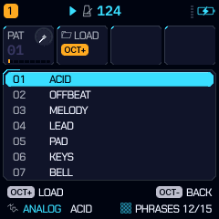 |  |  |
| **Row 3** |  | 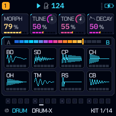 |  |
| **Row 4** |  |  |  |
| **Row 5** |  | 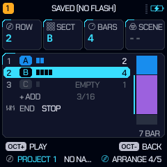 | 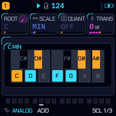 |
| **Row 6** |  | 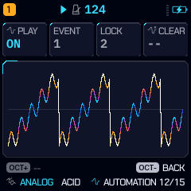 |  |
| **Row 7** | 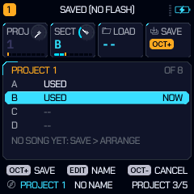 |  |  |
| **Row 8** |  |  | 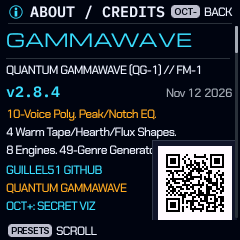 |
| **Row 9** |  | 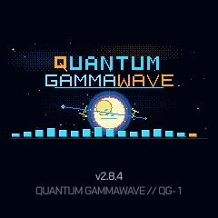 | 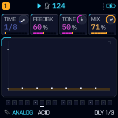 |
| **Row 10** | 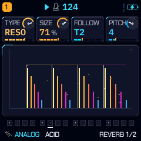 | 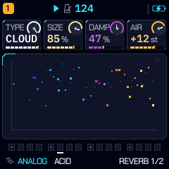 | 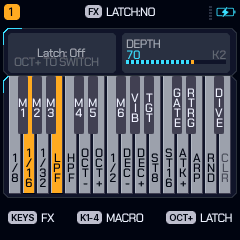 |

*All 37 screenshots rendered from the firmware at 240×240, scaled ×3 for GitHub display. Original PNGs reside in `assets/screenshots/`.*

---

## Highlights of `v3.0.1`

- **The target render loops fit their budgets.** `phase_render` 84/84, `wheel_block` 32/86,
  `noise_render` 218/201 and `fm6_render` 292/322 in the pi32v2 disassembly, with the historical
  budgets untouched and all 291 golden renders unchanged.
- **One version everywhere.** `FELUCCA_VERSION`, the package in `release/`, the emulator the portal
  serves and `firmware/versions.json` name the same build: the portal shows the version and the commit
  the release manifest carries, and the installer checks the package's SHA-256 and size before it writes.
- **The package is integrity-checked, not signed.** Since v2.6.0 the model is SHA-256 + size + build record;
  Ed25519 (`qg1-release-1`) stays historical. The installer and the site say "integrity, not authenticity"
  instead of implying a signature that does not exist.
- **ROOM is damped by the table the firmware uses.** `rev_room` and `rev_room_mod` read `rev_damp_table[]`,
  and the host reference model now carries its own copy of that curve, so a change on one side still fails
  the test (it used to compare against the pre-2.4.0 linear law).
- **The constant tables are measured, not estimated.** `tools/table_sizes.py` reads each table out of the
  linked AC791N ELF: **41 947 B** in total (S 14 669 · M 8 420 · L 5 049 · icons 7 885 · keycaps 5 414 ·
  shapes 158 · palettes 352), after the M face went to two horizontal phases (gap error **0.044 px**,
  `text_spacing_test`) and eleven icon cells no screen could reach were removed. HOME's five retired views
  took another **5 176 B** with them, so the image is **574 992 B** of a 583 612 B slot — **9 040 B** of
  room — and the package 610 959 B.
- **Five HOME screens** — MAIN, VISUALIZER, OVERVIEW, MIX, PERFORM — **twelve voices, six tracks, nine
  engines, 273 sounds.** HOME used to carry ten pages; the engine, matrix, envelope, system and routing
  ones were the same controls their own sections already have (EDIT, MOD, EDIT > ENV, SYSTEM, FX > BUSES),
  so they moved out instead of being drawn twice, and the walk is now five taps end to end. The bank is
  audited as data
  (`tools/preset_audit.py`: 0 problems) and measured as sound (`preset_levels`: bank median **−18.5 dBFS**,
  no clipping, every family within 0.5 dB of it).
- **The goldens are measured, not assumed.** 285 renders across every engine, preset, voice mode and FX send
  hash identically to `tests/golden.txt`; a sound that moves shows up as a named render, not a diff.
- **The emulator is the same release.** WASM **1 193 096 B**  sha256 `ce09f79d…`  built with Emscripten
  6.0.11 from `6c25f7f`, and its manifest is the one the site serves.

## Synthesis engines

Nine engines, all digital, all edited from the panel (`EDIT` page 1 and 2) and from the Web Studio:

| Engine | What it is | Edit |
|---|---|---|
| **ANALOG** | virtual-analog: two oscillators, sub, noise, ring, filter, drift | waveform, shape, detune, filter, envelope |
| **FM6** | six-operator FM, eight algorithms, feedback | algorithm, ratios, levels, envelopes, feedback |
| **PHASE** | phase-distortion / CZ-style, two lines | waveform, harmonics, distortion, envelope |
| **WHEEL** | tonewheel organ: nine drawbars, percussion, click, drive, rotary | registration, bars, percussion, drive, rotor |
| **VOICE** | formant / vowel synthesis | vowel, formant shift, breath, envelope |
| **LOFI** | reduced-rate and reduced-depth digital, retrigger and clock | rate, depth, clock, retrigger, envelope |
| **DRUM-X** | drum synthesis: twelve kit lanes, per-hit tune and decay | kit, tune, decay, snap, mute groups |
| **NOISE** | noise-based percussion and textures | colour, band, decay, tone |
| **WTABLE** | wavetable: eight frames morphed by hand, LFO or envelope, with a tilt for harmonics | table position, harmonics, unison, filter |

273 factory sounds are spread across them, plus user preset slots. Presets and projects from earlier
versions keep loading.

## Tracks, voices and CPU

| Setting | Tracks | Notes |
|---|---|---|
| **ECO** | 4 | the lightest: fewer parts, no chorus, the slicer off, every reverb a spring |
| **BAL** | 5 | the middle setting |
| **FULL** | 6 | all six parts, the full effects chain |

Twelve voices are shared by the parts, with psychoacoustic stealing: a released tail about to die goes
first, then the quietest note, and the lowest held note of a POLY part is protected. Core 0 renders the
master buses, the UI and tracks 1–3; core 1 renders tracks 4–6.

## Sequencing and performance

- **64 steps a track**, six tracks, with per-step velocity, gate, timing, ratchet, conditions and
  parameter locks (automation events or one-shot locks).
- **Patterns** per engine with `PATTERNS`, and **MUTATE** to vary what is already playing.
- **ARP** with modes, octaves, walk and chord memory; **SCALES / CHORDS**; **STRUM**; **ROLL**.
- **Songs**: sixteen chain rows of sections with their bar counts.
- **Punch-in FX** on the fly: stutter, arp repeat, half tempo, octave, random, decay and more.
- **Live recording**, per-track mute and solo, and a **GLO** layer that recalls a whole performance state.

## Effects

- **Five reverbs**: ROOM, SPRING, SHIMMER, RESO and CLOUD, each with its own decay and mix.
- **Delay** with its own bars, **chorus**, and a **slicer** that plays recorded material back in time.
- **Parametric master EQ** with a graphic display, a **limiter**, and **duck** / **punch** on the master bus.
- Per-track sends, an FX rack per track, and a mixer with six channels.

## Interface

- **HOME**: five screens. **MAIN** is the system — a star, three orbits and five planets, each answering
  its tracks and its own touch, under the galaxy band; **VISUALIZER** is the full-screen scope; **OVERVIEW**
  the part at a glance; **MIX** the six channels; **PERFORM** the live settings. The footer counts them
  (`HOME n/5`).
- **Full-screen visualizer** (HOME twice): phosphor oscilloscope, phase trace, spectrum bars with peaks, the
  six track meters and the quantum motes.
- **Pages** for each engine, the FX rack, the mixer, the sequencer, the presets, the master bus, MIDI, the
  console and the preferences, on a 240 × 240 panel with fourteen buttons and seven encoders.
- The whole UI is rendered by the firmware sources and checked by the render sweep and its alignment lint.

## MIDI, projects and tools

- **USB-MIDI** in and out, with channel routing, a selectable track, and **SysEx** for the Web Studio and for
  backup / restore.
- **Projects**: song slots, patterns, automation, mixer and sound, saved and loaded on the unit.
- **Web Studio** edits the real sound over Web MIDI, and its hardware view shows the panel live.
- **Backup and restore** read the unit's flash through the loader.

## Hardware

| | |
|---|---|
| Device | M-VAVE FM-1 (desktop groovebox / synthesizer) |
| SoC | JieLi AC791N / WL82, dual-core `pi32v2`, single-precision FPU |
| Memory | 578 KB SRAM reported by the SDK; the firmware keeps `.data + .bss` inside 96 KiB |
| Flash | 1 MiB SPI NOR, XIP at `0x02000000` |
| Panel | 240 × 240 ST7789-class RGB565 |
| Controls | 14 buttons, 7 rotary encoders, the MASTER pot and 27 micro-switch keys |

Only two flash parts are accepted by the loader — P25Q80H (`0x856014`) and UCUN UC25HQ80 (`0xB36014`) — and
an unknown part is refused before anything is erased.

## Installing

The installer is a web page that talks to the unit over USB-MIDI, and it is the only write path:

1. Open the **[installer](https://guillel51.github.io/Quantum-GammaWave/webapp/installer/)** in Chrome or
   Edge, with a data cable (not a charge-only one).
2. It re-hashes the package (**SHA-256** + size), holds it to the published record and the version floor, and
   verifies the firmware hashes inside it. `v3.0.0` is the package this tree builds; `v2.9.7`
   was published by the tag workflow on 2026-11-13. Both ship **unsigned by design**: that is integrity, not
   authenticity, and the page says so instead of implying a signature. If anything fails, INSTALL stays
   disabled and the page says why.
3. The loader reads the **real flash chip** on the unit and refuses anything but the two parts above.
4. The write covers `0x04000–0x92FFF`; factory data is preserved, and the loader is the recovery path.

**Before you write:** keep a backup of your unit, and read
[`FM1_INSTALLATION_SAFETY_AUDIT.md`](FM1_INSTALLATION_SAFETY_AUDIT.md). The installer never writes without
your confirmation, and there is no secure boot on this hardware — a verified package is not a guarantee about
a particular unit.

## Building from source

```sh
# target firmware (JieLi pi32v2 clang + the AC79 SDK)
JIELI_TOOLCHAIN=/path/to/toolchain AC79_SDK=/path/to/AC79_SDK python3 tools/build.py

# the 10-voice profile, and a pool size other than the default
FELUCCA_VOICES=10 python3 tools/build.py
FELUCCA_VPOOL=18 python3 tools/build.py

# the host tests: golden renders, voice / routing checks, UI, CPU budget
NO_PACKAGE=1 sh tests/run_tests.sh

# the browser emulator (needs emcc)
sh web/emu/build.sh
```

`build.sh` produces the `.fwsc` package. See [`BUILDING.md`](BUILDING.md) for the full setup and
[`docs/`](docs/) for the audits, the validation matrix and the memory baseline.

## Documentation

| | |
|---|---|
| [`docs/MANUAL.md`](docs/MANUAL.md) | the instrument, page by page |
| [`docs/VOICE_POOL.md`](docs/VOICE_POOL.md) | how the 12-voice pool works and what it measured |
| [`docs/OPTIMIZATION_BASELINE.md`](docs/OPTIMIZATION_BASELINE.md) | the memory regions and their floors |
| [`docs/VALIDATION_MATRIX.md`](docs/VALIDATION_MATRIX.md) | what is proven, by which test, on what |
| [`docs/HARDWARE_SPECS_FM1.md`](docs/HARDWARE_SPECS_FM1.md) | the unit as the code sees it |
| [`docs/EMULATOR_FIDELITY.md`](docs/EMULATOR_FIDELITY.md) | what the emulator does and does not reproduce |
| [`docs/FM1_HUB_READINESS.md`](docs/FM1_HUB_READINESS.md) | what The Firmware Hub asks for, what is done, and what still needs a real unit |
| [`docs/FM1_HUB_AUDIO_PROVENANCE.md`](docs/FM1_HUB_AUDIO_PROVENANCE.md) | every distributed audio and binary asset, its author and its licence |

## What this project does not claim

- No measurement on a physical FM-1 is part of this repository. The firmware is built with the AC791N
  toolchain and its behaviour is checked on the host and in the emulator; stack depth, interrupt timing and
  audio headroom **on the unit** are not measured here.
- Twelve voices are validated by the host suite and the static CPU budget, not by listening on hardware.
- Both flash parts are allowed by the code, not measured on hardware.
- No secure boot, no DRM, no vendor material in the packages.

## Credits and licence

GPL-3.0-only. Quantum GammaWave is an evolution of **Pocket GammaWave (GW-1)** by **Frederic Valente
(@fvalente)** — the GW-1 firmware line, its drum kits, its keys/trap presets and its persistence work — built on
**JIANT FM** and **Felucca** by **Leo Kuroshita (@kurogedelic) / Hügelton Instruments**. The published installer,
the emulator's CI and build record, the FX layer and the QUANTUM preset bank come from **Guillermo Lauria**;
**David Konsumer (@konsumer)** did the first install on a stock unit, the loader's chip check, the resume path and
the releases by tag. The original copyright notices,
the credits and the texts in [`LICENSES/`](LICENSES/) are kept; the JieLi SDK files that a package carries are
Apache-2.0, and [`LICENSING.md`](LICENSING.md) says which is which.
